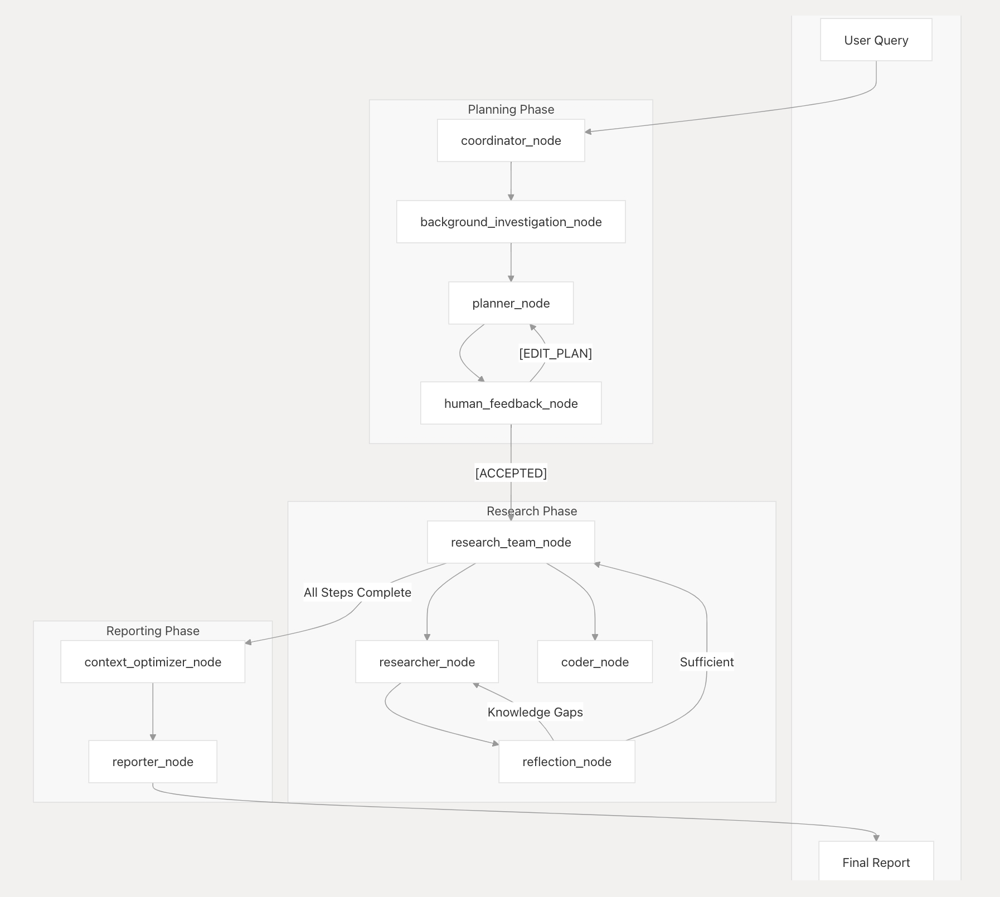

<div align="center">

# 🦌 SmartDeerFlow

**AI-Powered Deep Research Framework with Multi-Agent Collaboration**

[](https://www.python.org/downloads/)
[](https://opensource.org/licenses/MIT)
[](https://github.com/hqzhon/smart-deer-flow/stargazers)
[](https://github.com/hqzhon/smart-deer-flow/network/members)
[](https://github.com/hqzhon/smart-deer-flow/issues)
[](https://github.com/hqzhon/smart-deer-flow/commits/main)
[](https://deepwiki.com/hqzhon/smart-deer-flow)

[English](./README.md) | [简体中文](./README_zh.md)

</div>

## 🚀 Overview

**SmartDeerFlow** is a community-driven AI research framework that combines **Large Language Models**, **Multi-Agent Systems**, and **Advanced Tools** for automated research, content generation, and data analysis.

**Key Highlights:**
- 🤖 **Multi-Agent Collaboration** - Intelligent task distribution with role-based specialization and cross-agent communication
- 🧠 **GFLQ Reflection System** - Self-improving research quality with knowledge gap detection and iterative enhancement
- 🔄 **Adaptive Research Flow** - Dynamic strategy adjustment and consensus building across multiple agents
- 🔍 **Multi-Source Intelligence** - Tavily, Brave, DuckDuckGo, ArXiv integration with smart content analysis
- 📊 **Rich Output Formats** - Reports, Podcasts, Presentations with AI-powered generation
- 🌐 **Flexible Interfaces** - Web & Console UI with human-in-the-loop collaboration
- 🔗 **Extensible Architecture** - MCP protocol integration and RAG knowledge base support

> Forked from [DeerFlow](https://github.com/bytedance/deer-flow) with enhanced features and community-driven improvements.


## 📑 Table of Contents

- [🚀 Quick Start](#-quick-start)
- [🌟 Features](#-features)
- [⚡ Performance](#-performance)
- [🏗️ Architecture](#-architecture)
- [🧠 Context Engineering System](#-context-engineering-system)
- [🔄 GFLQ Reflection Integration](#-gflq-reflection-integration)
- [📚 Examples](#-examples)
- [🐳 Docker](#-docker)
- [🛠️ Development](#-development)
- [❓ FAQ](#-faq)
- [📜 License](#-license)

## 🚀 Quick Start

### Prerequisites

- **Python 3.12+** and **Node.js 22+**
- **Recommended:** [`uv`](https://docs.astral.sh/uv/) for Python, [`pnpm`](https://pnpm.io/) for Node.js

### Installation

```bash
# 1. Clone and setup
git clone https://github.com/hqzhon/smart-deer-flow.git
cd smart-deer-flow
uv sync

# 2. Configure API keys
cp .env.example .env          # Add your API keys (Tavily, Brave, etc.)
cp conf.yaml.example conf.yaml  # Configure LLM settings

# 3. Optional: Install additional tools
brew install marp-cli         # For PPT generation
cd web && pnpm install        # For Web UI
```

### Usage

```bash
# Console Mode (Quick Start)
uv run main.py "What is quantum computing?"

# Interactive Mode
uv run main.py --interactive

# Web UI Mode
./bootstrap.sh -d  # macOS/Linux
# Visit http://localhost:3000
```

> 📖 **Configuration:** See [Configuration Guide](docs/configuration_guide.md) for detailed setup instructions.

## Supported Search Engines

SmartDeerFlow supports multiple search engines that can be configured in your `.env` file using the `SEARCH_API` variable:

- **Tavily** (default): A specialized search API for AI applications

  - Requires `TAVILY_API_KEY` in your `.env` file
  - Sign up at: https://app.tavily.com/home

- **DuckDuckGo**: Privacy-focused search engine

  - No API key required

- **Brave Search**: Privacy-focused search engine with advanced features

  - Requires `BRAVE_SEARCH_API_KEY` in your `.env` file
  - Sign up at: https://brave.com/search/api/

- **Arxiv**: Scientific paper search for academic research
  - No API key required
  - Specialized for scientific and academic papers

To configure your preferred search engine, set the `SEARCH_API` variable in your `.env` file:

```bash
# Choose one: tavily, duckduckgo, brave_search, arxiv
SEARCH_API=tavily
```

## 🤖 Multi-Agent System

### Agent Architecture
| Agent | Role | Capabilities |
|-------|------|-------------|
| **Coordinator** | Workflow Manager | Task orchestration, user interface |
| **Planner** | Strategic Planning | Research decomposition, execution planning |
| **Researcher** | Information Gathering | Multi-source search, content analysis |
| **Coder** | Technical Analysis | Code execution, data processing |
| **Reporter** | Content Generation | Report synthesis, output formatting |

## 🌟 Features

### 🤖 AI & LLM Integration
- **Multi-Model Support** - OpenAI, Anthropic, Qwen, and more via [LiteLLM](https://docs.litellm.ai/docs/providers)
- **Smart Agent Coordination** - Dynamic task distribution and collaboration
- **Context-Aware Processing** - Intelligent content understanding and generation

### 🔍 Research & Data Collection
- **Multi-Source Search** - Tavily, Brave, DuckDuckGo, ArXiv integration
- **Web Crawling** - Advanced content extraction with Jina
- **RAG Integration** - Private knowledge base support via [RAGFlow](https://github.com/infiniflow/ragflow)
- **MCP Extensions** - Expandable tool ecosystem

### 🤖 Multi-Agent Collaboration
- **Intelligent Coordination** - Dynamic task distribution and agent orchestration
- **Reflection Mechanism** - Self-evaluation and iterative improvement
- **Knowledge Gap Detection** - Automatic identification of missing information
- **Adaptive Planning** - Dynamic research strategy adjustment
- **Cross-Agent Communication** - Seamless information sharing between agents
- **Role-Based Specialization** - Each agent optimized for specific tasks
- **Consensus Building** - Multi-agent decision making and validation

### 📊 Content Generation
- **Research Reports** - Comprehensive analysis and documentation
- **Podcast Scripts** - AI-powered audio content generation with TTS
- **Presentations** - Automated PowerPoint creation via Marp
- **Interactive Editing** - Notion-style block editing with AI assistance
- **Multi-Format Output** - JSON, Markdown, HTML, PDF support
- **Voice Synthesis** - Volcengine TTS integration for audio reports
- **Chart Generation** - Automated data visualization via MCP Chart Server

### 🤝 Human Collaboration
- **Human-in-the-Loop** - Interactive plan review and modification
- **Real-time Feedback** - Natural language plan editing
- **Consensus Systems** - Multi-agent decision making
- **Role-based Access** - Dynamic permission management

### 🔗 MCP (Model Context Protocol) Integration
- **Extensible Tool Ecosystem** - Support for MCP servers and custom tools
- **Chart Generation** - Built-in MCP Chart Server for data visualization
- **GitHub Integration** - MCP GitHub Trending for repository analysis
- **Search Extensions** - Tavily MCP for enhanced search capabilities
- **Custom MCP Servers** - Easy integration of third-party MCP services
- **Dynamic Tool Loading** - Runtime tool discovery and configuration
- **API-First Design** - RESTful endpoints for MCP server management

### 🧠 Advanced AI Features
- **GFLQ Reflection Mechanism** - Self-improving research quality
- **Knowledge Gap Detection** - Automatic identification of missing information
- **Iterative Research Enhancement** - Continuous improvement of research strategies
- **Context-Aware Processing** - Intelligent understanding of research objectives
- **Multi-Model Orchestration** - Seamless integration across different LLM providers

## 🏗️ Architecture

DeerFlow implements a modular multi-agent system architecture designed for automated research and code analysis. The system is built on LangGraph, enabling a flexible state-based workflow where components communicate through a well-defined message passing system.

### Multi-Agent Collaboration Flow



The system employs a streamlined workflow with the following components:

1. **Coordinator**: The entry point that manages the workflow lifecycle

   - Initiates the research process based on user input
   - Delegates tasks to the planner when appropriate
   - Acts as the primary interface between the user and the system

2. **Planner**: Strategic component for task decomposition and planning

   - Analyzes research objectives and creates structured execution plans
   - Determines if enough context is available or if more research is needed
   - Manages the research flow and decides when to generate the final report

3. **Research Node**: An intelligent research component with reflection capabilities:

   - **Independent State Management**: Maintains its own research context and progress
   - **Reflection Analysis**: Self-evaluates research quality and completeness
   - **Knowledge Gap Detection**: Identifies missing information automatically
   - **Adaptive Research**: Generates follow-up queries based on reflection results
   - **Multi-Tool Integration**: Uses web search, crawling, and MCP services

4. **Specialized Agents**: Supporting agents for specific tasks:
   - **Coder**: Handles code analysis, execution, and technical tasks using Python REPL tool
   - Each agent operates within the LangGraph framework with optimized tool access

5. **Reporter**: Final stage processor for research outputs
   - Aggregates findings from the research team
   - Processes and structures the collected information
   - Generates comprehensive research reports

## 🧠 Context Engineering System

**SmartDeerFlow** implements an advanced Context Engineering system following Manus AI principles for optimal LLM context management and efficiency.

### Overview

The Context Engineering system provides unified context management through multiple specialized components:

| Component | Purpose | Key Principle |
|-----------|---------|---------------|
| **FileBasedMemory** | Filesystem as unlimited external memory | Persist context beyond token limits |
| **AttentionManager** | Attention manipulation through restatement | Control model focus areas |
| **KVCacheOptimizer** | KV-Cache optimization with stable prefix | Maximize cache hit rate |
| **SmartCompressor** | Intelligent context compression | Preserve critical information |
| **DiversityInjector** | Avoid few-shot traps | Prevent pattern fixation |
| **ErrorRecovery** | Preserve error content for learning | Learn from failures |

### Key Features

- 📁 **File-Based External Memory** - Use filesystem as unlimited context storage
- 🎯 **Attention Manipulation** - Control model focus through strategic restatement
- ⚡ **KV-Cache Optimization** - Stable prefix design for maximum cache efficiency
- 🗜️ **Smart Compression** - Intelligent content compression preserving key information
- 🎲 **Diversity Injection** - Prevent pattern fixation with controlled variation
- 🔄 **Error Recovery** - Keep failed attempts in context for implicit learning
- 🎭 **Tool Masking** - Constrain actions via logit masking, not removal

### Architecture Principles

```
┌─────────────────────────────────────────────────────────────┐
│                  Context Engineering Manager                 │
├─────────────────────────────────────────────────────────────┤
│  ┌──────────────┐  ┌──────────────┐  ┌──────────────┐      │
│  │ File Memory  │  │  Attention   │  │  KV-Cache    │      │
│  │   (Persist)  │  │ (Manipulate) │  │  (Optimize)  │      │
│  └──────────────┘  └──────────────┘  └──────────────┘      │
│  ┌──────────────┐  ┌──────────────┐  ┌──────────────┐      │
│  │ Compressor   │  │  Diversity   │  │    Error     │      │
│  │  (Compress)  │  │  (Variation) │  │  (Learning)  │      │
│  └──────────────┘  └──────────────┘  └──────────────┘      │
└─────────────────────────────────────────────────────────────┘
```

### Configuration

```python
from src.context import ContextEngineeringManager, ContextEngineeringConfig

config = ContextEngineeringConfig(
    enable_file_memory=True,
    enable_attention_injection=True,
    enable_kv_cache=True,
    enable_smart_compression=True,
    max_context_tokens=8000,
    attention_injection_interval=5,
)

manager = ContextEngineeringManager(config)
```

## 🔄 GFLQ Reflection Integration

**SmartDeerFlow** implements an advanced reflection mechanism based on GFLQ (Goal-Focused Learning Query) with the new **Reflexion Agent**:

| Feature | Description |
|---------|-------------|
| **Multi-Gap Identification** | Identify multiple knowledge gaps |
| **External Knowledge Retrieval** | Search for information to fill gaps |
| **Knowledge Integration** | Merge external knowledge into research |
| **Smart Reflection Controller** | Adaptive reflection based on context |
| **Gap Prioritization** | Rank gaps by importance and feasibility |

### Key Benefits

- 🎯 **Improved Research Quality** - More comprehensive and complete results
- 🔄 **Intelligent Adaptation** - System learns and improves strategies
- ⚡ **Reduced Manual Intervention** - Automatic gap detection and follow-up

> **Details**: [GFLQ Reflection Integration](./docs/GFLQ_REFLECTION_en.md)


## 🛠️ Integrated Tools & Services

### Text-to-Speech Integration

DeerFlow includes advanced TTS capabilities for converting research reports to high-quality audio:

```bash
# TTS API with customizable parameters
curl --location 'http://localhost:8000/api/tts' \
--header 'Content-Type: application/json' \
--data '{
    "text": "Research report content...",
    "speed_ratio": 1.0,
    "volume_ratio": 1.0,
    "pitch_ratio": 1.0
}' \
--output research_audio.mp3
```

### Built-in Tool Suite

| Tool | Purpose | Configuration |
|------|---------|---------------|
| **SmartSearchTool** | Multi-source web search | Tavily, DuckDuckGo, Brave, ArXiv |
| **WebCrawler** | Content extraction | Jina API integration |
| **PythonREPL** | Code execution | Sandboxed Python environment |
| **VolcengineTTS** | Voice synthesis | Customizable voice parameters |
| **RAGRetriever** | Knowledge base | RAGFlow integration |
| **MCPChart** | Data visualization | Flow diagrams, charts, maps |

### Agent Coordination Tools

- **State Manager** - Cross-agent state synchronization
- **Message Router** - Inter-agent communication
- **Task Scheduler** - Intelligent task distribution
- **Reflection Engine** - Self-evaluation and improvement
- **Knowledge Graph** - Contextual information management

## 🛠️ Development

### Quick Commands
```bash
# Testing
pytest tests/ --cov=deer_flow

# Code Quality
ruff format . && ruff check .

# Debug with LangGraph Studio
# Install: https://github.com/langchain-ai/langgraph-studio
```

### Debugging with LangGraph Studio

DeerFlow uses LangGraph for its workflow architecture. You can use LangGraph Studio to debug and visualize the workflow in real-time.

#### Running LangGraph Studio Locally

DeerFlow includes a `langgraph.json` configuration file that defines the graph structure and dependencies for the LangGraph Studio. This file points to the workflow graphs defined in the project and automatically loads environment variables from the `.env` file.

##### Mac

```bash
# Install uv package manager if you don't have it
curl -LsSf https://astral.sh/uv/install.sh | sh

# Install dependencies and start the LangGraph server
uvx --refresh --from "langgraph-cli[inmem]" --with-editable . --python 3.12 langgraph dev --allow-blocking
```

##### Windows / Linux

```bash
# Install dependencies
pip install -e .
pip install -U "langgraph-cli[inmem]"

# Start the LangGraph server
langgraph dev
```

After starting the LangGraph server, you'll see several URLs in the terminal:

- API: http://127.0.0.1:2024
- Studio UI: https://smith.langchain.com/studio/?baseUrl=http://127.0.0.1:2024
- API Docs: http://127.0.0.1:2024/docs

Open the Studio UI link in your browser to access the debugging interface.

#### Using LangGraph Studio

In the Studio UI, you can:

1. Visualize the workflow graph and see how components connect
2. Trace execution in real-time to see how data flows through the system
3. Inspect the state at each step of the workflow
4. Debug issues by examining inputs and outputs of each component
5. Provide feedback during the planning phase to refine research plans

When you submit a research topic in the Studio UI, you'll be able to see the entire workflow execution, including:

- The planning phase where the research plan is created
- The feedback loop where you can modify the plan
- The research and writing phases for each section
- The final report generation

### Enabling LangSmith Tracing

DeerFlow supports LangSmith tracing to help you debug and monitor your workflows. To enable LangSmith tracing:

1. Make sure your `.env` file has the following configurations (see `.env.example`):

   ```bash
   LANGSMITH_TRACING=true
   LANGSMITH_ENDPOINT="https://api.smith.langchain.com"
   LANGSMITH_API_KEY="xxx"
   LANGSMITH_PROJECT="xxx"
   ```

2. Start tracing and visualize the graph locally with LangSmith by running:
   ```bash
   langgraph dev
   ```

This will enable trace visualization in LangGraph Studio and send your traces to LangSmith for monitoring and analysis.

## 🐳 Docker

```bash
# Quick start with Docker Compose
docker-compose up --build

# Run in background
docker-compose up -d
```

**Access:** http://localhost:3000

**Includes:** Backend API + Frontend UI + Data persistence

## 📚 Examples

### Research Reports
```bash
# Generate comprehensive research report
uv run main.py "AI impact on healthcare"

# Custom planning parameters
uv run main.py --max_plan_iterations 3 "Quantum computing impact"
```

### Interactive Mode
```bash
# Interactive session with built-in questions
uv run main.py --interactive

# Basic interactive prompt
uv run main.py
```

### Sample Reports
- [OpenAI Sora Analysis](examples/openai_sora_report.md)
- [AI in Healthcare](examples/AI_adoption_in_healthcare.md)
- [Quantum Cryptography](examples/Quantum_Computing_Impact_on_Cryptography.md)
> All of the above examples are generated by SmartDeerFlow using the latest features and enhancements. It's api powered by deepseek v3.

## 🔧 Configuration & Usage

### Command Line Options

```bash
# Basic options
uv run main.py "Your research question"
uv run main.py --interactive
uv run main.py --enable-human-in-loop "Your question"

# Agent configuration
uv run main.py --enable-reflection --max-reflection-loops 3
uv run main.py --agent-mode advanced --max_plan_iterations 5

# Output formats
uv run main.py --output-format report "Your question"

# View all options
uv run main.py --help
```

### Interactive Mode

The application supports an interactive mode with built-in questions in both English and Chinese:

1. Launch the interactive mode:
   ```bash
   uv run main.py --interactive
   ```

2. Select your preferred language (English or 中文)
3. Choose from a list of built-in questions or ask your own question
4. The system will process your question and generate a comprehensive research report

### Human in the Loop

SmartDeerFlow includes a human in the loop mechanism that allows you to review, edit, and approve research plans before they are executed:

1. **Plan Review**: When enabled, the system presents the generated research plan for your review
2. **Providing Feedback**: Accept with `[ACCEPTED]` or edit with `[EDIT PLAN] Your feedback`
3. **API Integration**: Use the `feedback` parameter in API calls to provide plan modifications

## ❓ FAQ

**Q: How do I configure API keys?**
A: Copy `.env.example` to `.env` and add your keys. See [Configuration Guide](docs/configuration_guide.md).

**Q: Can I use local models?**
A: Yes, supports Ollama and other local providers via `.env` configuration.

**Q: How to enable reflection mechanism?**
A: Set `DEER_FLOW_ENABLE_REFLECTION=true` and use `--enable-reflection` flag.

**Q: What search engines are supported?**
A: Tavily, Brave, DuckDuckGo, ArXiv, and more via MCP integrations.

**Q: How to contribute?**
A: Fork → Make changes → Submit PR. Check contribution guidelines.

## 🌐 API Reference

### Core Endpoints

```bash
# Research Generation
POST /api/chat/stream
Content-Type: application/json
{
  "message": "Research question",
  "enable_human_feedback": true,
  "mcp_settings": {
    "servers": {
      "mcp-chart": {
        "transport": "stdio",
        "enabled_tools": ["generate_flow_diagram"]
      }
    }
  }
}

# Text-to-Speech
POST /api/tts
Content-Type: application/json
{
  "text": "Content to synthesize",
  "speed_ratio": 1.0,
  "volume_ratio": 1.0,
  "pitch_ratio": 1.0
}

# MCP Server Management
POST /api/mcp/server/metadata
Content-Type: application/json
{
  "transport": "stdio",
  "command": "uvx",
  "args": ["mcp-github-trending"],
  "env": {"API_KEY": "value"}
}

# Agent Status
GET /api/agents/status
GET /api/agents/reflection/state
```

### WebSocket Streaming

```javascript
// Real-time research updates
const ws = new WebSocket('ws://localhost:8000/ws/research');
ws.onmessage = (event) => {
  const data = JSON.parse(event.data);
  console.log('Research update:', data);
};
```

## 📄 License

This project is open source and available under the [MIT License](./LICENSE).

## 🙏 Acknowledgments

**Built with:** [LangChain](https://langchain.com/) • [LangGraph](https://langchain-ai.github.io/langgraph/) • [FastAPI](https://fastapi.tiangolo.com/)
**Forked from:** [DeerFlow](https://github.com/bytedance/deer-flow) by ByteDance
**Thanks to:** [gemini-fullstack-langgraph-quickstart](https://github.com/google-gemini/gemini-fullstack-langgraph-quickstart)
**Thanks to:** All contributors and the open-source community
