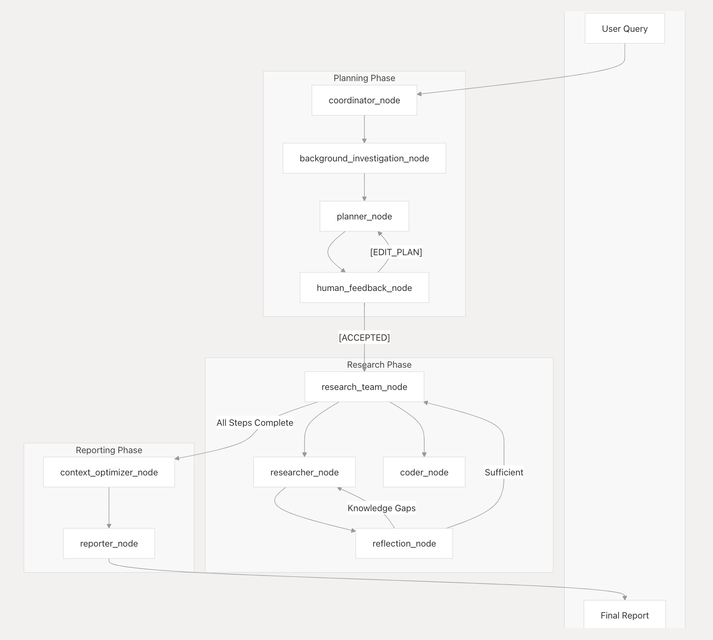

<div align="center">

# 🦌 SmartDeerFlow

[](https://www.python.org/downloads/)
[](https://opensource.org/licenses/MIT)
[](https://deepwiki.com/hqzhon/smart-deer-flow)

**AI 驱动的深度研究框架，支持多智能体协作**

[English](./README.md) | [简体中文](./README_zh.md)

</div>

## 🌟 概述

**SmartDeerFlow** 是一个社区驱动的 AI 研究框架，从 [DeerFlow](https://github.com/bytedance/deer-flow) fork 而来并进行了增强。它将大型语言模型与专业工具（网络搜索、爬虫、代码执行）相结合，提供强大的研究和内容生成能力。

### ✨ 核心亮点

- 🤖 **多智能体协作** - 协调器、规划器、研究员和编码员的智能协作
- ⚡ **性能优化** - 4-16 个工作进程的并行处理和智能调度
- 🔍 **多源搜索** - Tavily、Brave、DuckDuckGo、ArXiv 集成
- 📊 **丰富输出格式** - 研究报告、播客脚本、演示文稿
- 🌐 **Web & 控制台界面** - 灵活的用户交互方式
- 🔧 **可扩展架构** - MCP 协议支持和工具生态系统

> **Fork 来源：** 本项目基于 ByteDance 的 [DeerFlow](https://github.com/bytedance/deer-flow) 开发，增加了性能优化、协作功能和用户体验改进。

---

## 📑 目录

- [🚀 快速开始](#-快速开始)
- [⚡ 性能优化](#-性能优化)
- [🌟 功能特性](#-功能特性)
- [🏗️ 架构](#-架构)
- [🛠️ 开发](#️-开发)
- [🐳 Docker](#-docker)
- [📚 示例](#-示例)
- [🔧 命令行选项](#-命令行选项)
- [❓ 常见问题](#-常见问题)
- [📄 许可证](#-许可证)
- [🙏 致谢](#-致谢)

## 🚀 快速开始

### 先决条件
- **Python 3.12+** 和 **Node.js 22+**
- 推荐工具：[`uv`](https://docs.astral.sh/uv/) (Python) 和 [`pnpm`](https://pnpm.io/) (Node.js)

### 安装

#### 1. 克隆和设置
```bash
git clone https://github.com/hqzhon/smart-deer-flow.git
cd smart-deer-flow
uv sync  # 自动创建虚拟环境并安装依赖
```

#### 2. 配置 API 密钥
```bash
cp .env.example .env
cp conf.yaml.example conf.yaml
# 编辑 .env 和 conf.yaml 文件，添加您的 API 密钥
```

#### 3. 可选：安装额外工具
```bash
# Web UI 依赖
cd web && pnpm install

# PPT 生成工具
brew install marp-cli
```

### 使用方法

#### 控制台模式（快速启动）
```bash
uv run main.py "您的研究问题"
```

#### 交互模式
```bash
uv run main.py --interactive
```

#### Web UI 模式
```bash
./bootstrap.sh -d  # macOS/Linux
bootstrap.bat -d   # Windows
# 访问 http://localhost:3000
```

📖 **配置指南：** [详细配置说明](docs/configuration_guide.md)

## ⚡ 性能优化

### 优化级别
| 级别 | 工作进程 | 功能特性 |
|------|----------|----------|
| **基础** | 4 | 并行处理 |
| **标准** | 8 | 速率限制、缓存 |
| **高级** | 12 | 智能调度 |
| **最大** | 16 | ML 驱动优化 |

### 快速设置
```bash
# 启用性能模式
cp .env.performance.example .env.performance
export DEER_FLOW_ENABLE_ADVANCED_OPTIMIZATION=true
```

📖 **详细指南：** [性能优化](./README_PERFORMANCE.md) | [并行优化](./README_PARALLEL_OPTIMIZATION.md)

## 支持的搜索引擎

DeerFlow 支持多种搜索引擎，可以在`.env`文件中通过`SEARCH_API`变量进行配置：

- **Tavily**（默认）：专为 AI 应用设计的专业搜索 API

  - 需要在`.env`文件中设置`TAVILY_API_KEY`
  - 注册地址：https://app.tavily.com/home

- **DuckDuckGo**：注重隐私的搜索引擎

  - 无需 API 密钥

- **Brave Search**：具有高级功能的注重隐私的搜索引擎

  - 需要在`.env`文件中设置`BRAVE_SEARCH_API_KEY`
  - 注册地址：https://brave.com/search/api/

- **Arxiv**：用于学术研究的科学论文搜索
  - 无需 API 密钥
  - 专为科学和学术论文设计

要配置您首选的搜索引擎，请在`.env`文件中设置`SEARCH_API`变量：

```bash
# 选择一个：tavily, duckduckgo, brave_search, arxiv
SEARCH_API=tavily
```

## 🌟 功能特性

### 🤖 AI & LLM 集成
- **多智能体协作** - 基于 LangGraph 的专业化代理系统
- **自适应研究策略** - 根据发现动态调整研究方向
- **智能内容生成** - AI 驱动的高质量内容创作
- **MCP 服务器支持** - 扩展模型上下文协议集成

### 🔍 研究与数据收集
- **多源搜索引擎** - Tavily、Brave、Bing、Google、Serper、SearXNG
- **并行信息检索** - 同时查询多个数据源
- **智能过滤与排序** - 高质量信息筛选
- **实时数据更新** - 获取最新信息

### ⚡ 性能与优化
- **并行处理架构** - 多线程异步执行
- **智能负载均衡** - 资源优化分配
- **缓存机制** - 提升响应速度
- **可扩展设计** - 支持高并发场景

### 📊 内容生成
- **多格式输出** - Markdown、PDF、DOCX、PowerPoint
- **模板系统** - 可自定义输出格式
- **数据可视化** - 图表和图形生成
- **引用管理** - 自动引用和参考文献

### 👥 人机协作
- **交互模式** - 实时协作和反馈
- **人工干预** - 生成过程中的编辑控制
- **质量审核** - 人工验证机制
- **迭代优化** - 基于反馈的持续改进

## 架构

DeerFlow 实现了一个模块化的多智能体系统架构，专为自动化研究和代码分析而设计。该系统基于 LangGraph 构建，实现了灵活的基于状态的工作流，其中组件通过定义良好的消息传递系统进行通信。



> 在[deerflow.tech](https://deerflow.tech/#multi-agent-architecture)上查看实时演示

系统采用了精简的工作流程，包含以下组件：

1. **协调器**：管理工作流生命周期的入口点

   - 根据用户输入启动研究过程
   - 在适当时候将任务委派给规划器
   - 作为用户和系统之间的主要接口

2. **规划器**：负责任务分解和规划的战略组件

   - 分析研究目标并创建结构化执行计划
   - 确定是否有足够的上下文或是否需要更多研究
   - 管理研究流程并决定何时生成最终报告

3. **研究团队**：执行计划的专业智能体集合：

   - **研究员**：使用网络搜索引擎、爬虫甚至 MCP 服务等工具进行网络搜索和信息收集。
   - **编码员**：使用 Python REPL 工具处理代码分析、执行和技术任务。
     每个智能体都可以访问针对其角色优化的特定工具，并在 LangGraph 框架内运行

4. **报告员**：研究输出的最终阶段处理器
   - 汇总研究团队的发现
   - 处理和组织收集的信息
   - 生成全面的研究报告

## 🛠️ 开发

### 快速命令
```bash
# 测试
uv run pytest --cov=deer_flow

# 代码质量
uv run ruff check --fix && uv run ruff format

# LangGraph Studio 调试
langgraph dev  # 访问 http://localhost:2024
```

## 🐳 Docker

### 快速启动
```bash
docker-compose up -d
# 访问 http://localhost:3000
```

**包含服务：** Web UI、API 后端、Redis 缓存

### LangGraph Studio 调试

DeerFlow 使用 LangGraph 作为其工作流架构。您可以使用 LangGraph Studio 实时调试和可视化工作流。

#### 本地运行 LangGraph Studio

DeerFlow 包含一个`langgraph.json`配置文件，该文件定义了 LangGraph Studio 的图结构和依赖关系。该文件指向项目中定义的工作流图，并自动从`.env`文件加载环境变量。

##### Mac

```bash
# 如果您没有uv包管理器，请安装它
curl -LsSf https://astral.sh/uv/install.sh | sh

# 安装依赖并启动LangGraph服务器
uvx --refresh --from "langgraph-cli[inmem]" --with-editable . --python 3.12 langgraph dev --allow-blocking
```

##### Windows / Linux

```bash
# 安装依赖
pip install -e .
pip install -U "langgraph-cli[inmem]"

# 启动LangGraph服务器
langgraph dev
```

启动 LangGraph 服务器后，您将在终端中看到几个 URL：

- API: http://127.0.0.1:2024
- Studio UI: https://smith.langchain.com/studio/?baseUrl=http://127.0.0.1:2024
- API 文档: http://127.0.0.1:2024/docs

在浏览器中打开 Studio UI 链接以访问调试界面。

#### 使用 LangGraph Studio

在 Studio UI 中，您可以：

1. 可视化工作流图并查看组件如何连接
2. 实时跟踪执行情况，了解数据如何在系统中流动
3. 检查工作流每个步骤的状态
4. 通过检查每个组件的输入和输出来调试问题
5. 在规划阶段提供反馈以完善研究计划

当您在 Studio UI 中提交研究主题时，您将能够看到整个工作流执行过程，包括：

- 创建研究计划的规划阶段
- 可以修改计划的反馈循环
- 每个部分的研究和写作阶段
- 最终报告生成

### 启用 LangSmith 追踪

DeerFlow 支持 LangSmith 追踪功能，帮助您调试和监控工作流。要启用 LangSmith 追踪：

1. 确保您的 `.env` 文件中有以下配置（参见 `.env.example`）：
   ```bash
   LANGSMITH_TRACING=true
   LANGSMITH_ENDPOINT="https://api.smith.langchain.com"
   LANGSMITH_API_KEY="xxx"
   LANGSMITH_PROJECT="xxx"
   ```

2. 通过运行以下命令本地启动 LangSmith 追踪：
   ```bash
   langgraph dev
   ```

这将在 LangGraph Studio 中启用追踪可视化，并将您的追踪发送到 LangSmith 进行监控和分析。

## Docker

您也可以使用 Docker 运行此项目。

首先，您需要阅读下面的[配置](#配置)部分。确保`.env`和`.conf.yaml`文件已准备就绪。

其次，构建您自己的 Web 服务器 Docker 镜像：

```bash
docker build -t deer-flow-api .
```

最后，启动运行 Web 服务器的 Docker 容器：

```bash
# 将deer-flow-api-app替换为您首选的容器名称
docker run -d -t -p 8000:8000 --env-file .env --name deer-flow-api-app deer-flow-api

# 停止服务器
docker stop deer-flow-api-app
```

### Docker Compose

您也可以使用 docker compose 设置此项目：

```bash
# 构建docker镜像
docker compose build

# 启动服务器
docker compose up
```

## 文本转语音集成

DeerFlow 现在包含一个文本转语音(TTS)功能，允许您将研究报告转换为语音。此功能使用火山引擎 TTS API 生成高质量的文本音频。速度、音量和音调等特性也可以自定义。

### 使用 TTS API

您可以通过`/api/tts`端点访问 TTS 功能：

```bash
# 使用curl的API调用示例
curl --location 'http://localhost:8000/api/tts' \
--header 'Content-Type: application/json' \
--data '{
    "text": "这是文本转语音功能的测试。",
    "speed_ratio": 1.0,
    "volume_ratio": 1.0,
    "pitch_ratio": 1.0
}' \
--output speech.mp3
```

## 📚 示例

```bash
# 研究报告生成
uv run main.py "人工智能在医疗保健中的影响"

# 性能模式
uv run main.py "市场分析" --performance-mode advanced

# 交互会话
uv run main.py --interactive
```

## 🔧 命令行选项

| 选项 | 描述 | 默认值 |
|------|------|--------|
| `--interactive` | 启用交互模式 | `false` |
| `--performance-mode` | 性能级别 (basic/standard/advanced/max) | `standard` |
| `--max-plan-iterations` | 最大规划迭代次数 | `3` |
| `--human-in-the-loop` | 启用人工干预 | `false` |
| `--output-format` | 输出格式 (markdown/pdf/docx/ppt) | `markdown` |

### 交互模式

应用程序现在支持带有英文和中文内置问题的交互模式：

1. 启动交互模式：

   ```bash
   uv run main.py --interactive
   ```

2. 选择您偏好的语言（English 或中文）

3. 从内置问题列表中选择或选择提出您自己问题的选项

4. 系统将处理您的问题并生成全面的研究报告

### 人在环中

DeerFlow 包含一个人在环中机制，允许您在执行研究计划前审查、编辑和批准：

1. **计划审查**：启用人在环中时，系统将在执行前向您展示生成的研究计划

2. **提供反馈**：您可以：

   - 通过回复`[ACCEPTED]`接受计划
   - 通过提供反馈编辑计划（例如，`[EDIT PLAN] 添加更多关于技术实现的步骤`）
   - 系统将整合您的反馈并生成修订后的计划

3. **自动接受**：您可以启用自动接受以跳过审查过程：

   - 通过 API：在请求中设置`auto_accepted_plan: true`

4. **API 集成**：使用 API 时，您可以通过`feedback`参数提供反馈：
   ```json
   {
     "messages": [{ "role": "user", "content": "什么是量子计算？" }],
     "thread_id": "my_thread_id",
     "auto_accepted_plan": false,
     "feedback": "[EDIT PLAN] 包含更多关于量子算法的内容"
   }
   ```

### 命令行参数

应用程序支持多个命令行参数来自定义其行为：

- **query**：要处理的研究查询（可以是多个词）
- **--interactive**：以交互模式运行，带有内置问题
- **--max_plan_iterations**：最大规划周期数（默认：1）
- **--max_step_num**：研究计划中的最大步骤数（默认：3）
- **--debug**：启用详细调试日志

## ❓ 常见问题

**Q: 如何配置 API 密钥？**  
A: 复制 `.env.example` 和 `conf.yaml.example`，然后编辑添加您的 API 密钥。

**Q: 可以使用本地模型吗？**  
A: 支持！通过 Ollama、vLLM、LM Studio 等本地推理服务。

**Q: 如何优化性能？**  
A: 启用并行处理、调整工作进程数、使用缓存和选择更快的模型。

**Q: 支持哪些搜索引擎？**  
A: Tavily、Brave、Bing、Google、Serper、SearXNG 等多种搜索引擎。

**Q: 如何贡献代码？**  
A: Fork 仓库 → 创建分支 → 提交更改 → 发起 Pull Request。

## 📄 许可证

本项目采用 MIT 许可证。详情请参阅 [LICENSE](LICENSE) 文件。

## 🙏 致谢

**核心依赖：** LangChain/LangGraph、Tavily、FastAPI、React/Next.js  
**Fork 来源：** 基于 [DeerFlow](https://github.com/bytedance/deer-flow) 增强开发  
**贡献者：** 感谢所有为项目做出贡献的开发者和用户

## Star History

[](https://star-history.com/#bytedance/deer-flow&Date)
